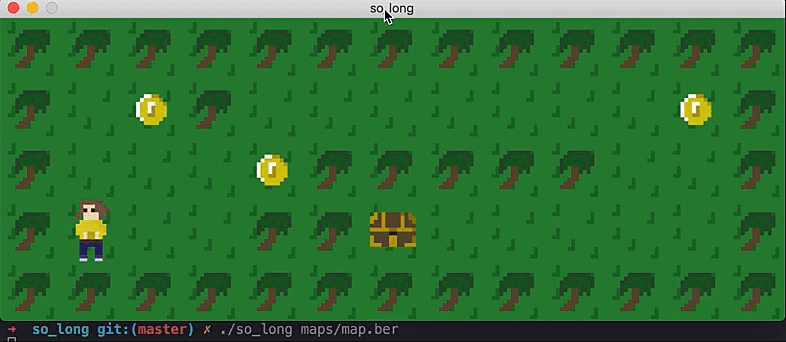
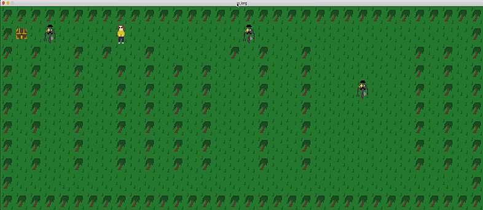
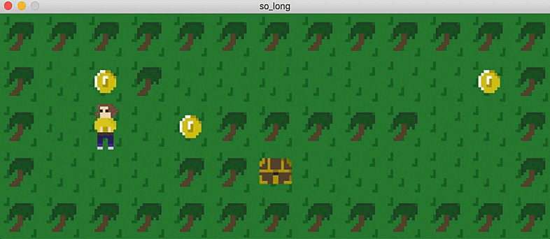

# so_long
2D Game project for 42 school

# Goal
Retrieve all the collectibles on the map and go to the chest with minimal movement

# Gameplay



Classic gameplay



With some enemies



And animation

# Compilation & execution

Use the ```make``` command to compile the program. For ennemies and animations, use ```make bonus```.

Then, launch the program using the command : ./so_long _path_of_map_

The format used for the map is .ber.

# Map construction

| Component                | Character     |
| ------------------------ | ------------- |
| Wall                     | 1             |
| Grass / Void             | 0             |
| Collectible              | C             |
| Player starting position | P             |
| Exit                     | E             |
| Ennemy (bonus only)      | A             |

# Map example

```
1111111111111
10C10000000C1
1000C11111001
1P0011E000001
1111111111111
```

```
111
101
1P1
1C1
101
101
1C1
101
101
1E1
111
```

```
1111111111111111111111111111111111
1E0000000000000C00000C000000000001
1010010100100000101001000000010101
1010010010101010001001000000010101
101A010010101010A01001000000010101
1010010010101010001001000000010101
1010010010101010001001000000010101
1010010010101010001001000000010101
101001001010101000100100A000010101
1P0000000C00C0000000000000000000C1
1111111111111111111111111111111111
```

# Map restriction

- The map must be surrounded by walls
- There should be at least one collectible and one exit
- Only pne starting position allowed
- Each line must be the same length (the map must be rectangular)
